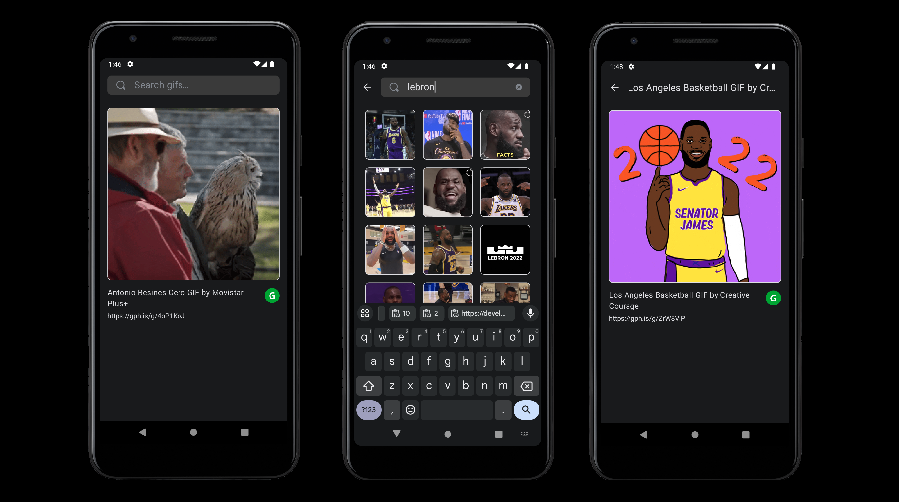

# Giphy REST API Integration
> Giphy API Integration android project written with Jetpack Compose

## Table of Contents
* [Technologies Used](#technologies-used)
* [Additional Dependencies](#technologies-used)
* [Features](#features)
* [Package Structure](#package-structure)
* [Setup](#setup)
* [Tests](#tests)
* [Screenshots](#screenshots)
* [Architecture](#architecture)

## Technologies Used

- [Kotlin](https://kotlinlang.org/) - First class and official programming language for Android development.
- [Coroutines](https://kotlinlang.org/docs/reference/coroutines-overview.html) - For asynchronous and more..
- [Jetpack Compose](https://developer.android.com/jetpack/compose) - Android’s modern toolkit for building native UI.
- [Android Architecture Components](https://developer.android.com/topic/libraries/architecture) - Collection of libraries that help you design robust, testable, and maintainable apps.
  -[ViewModel](https://developer.android.com/topic/libraries/architecture/viewmodel) - Stores UI-related data that isn't destroyed on UI changes.
- [Dependency Injection](https://developer.android.com/training/dependency-injection)
  - [Hilt-Dagger](https://dagger.dev/hilt/) - Standard library to incorporate Dagger dependency injection into an Android application.
  - [Hilt-ViewModel](https://developer.android.com/training/dependency-injection/hilt-jetpack) - DI for injecting `ViewModel`.
- [Glide](https://github.com/bumptech/glide) - A type-safe HTTP client for Android and Java.
- [Moshi](https://github.com/square/moshi) - A modern JSON library for Kotlin and Java.
  - [Moshi Converter](https://github.com/square/retrofit/tree/master/retrofit-converters/moshi) - A Converter which uses Moshi for serialization to and from JSON.
- [Material Components for Android](https://github.com/material-components/material-components-android) - Material components for visualisation
- [Espresso](https://developer.android.com/training/testing/espresso) - For UI tests

### Additional Dependencies

- [AndroidX Core KTX](https://developer.android.com/jetpack/androidx/releases/core) - AndroidX Core library for Kotlin
- [AndroidX Lifecycle Runtime KTX](https://developer.android.com/jetpack/androidx/releases/lifecycle) - AndroidX Lifecycle runtime library for Kotlin
- [AndroidX Activity Compose](https://developer.android.com/jetpack/androidx/releases/activity-compose) - AndroidX Activity Compose library
- [AndroidX Compose UI](https://developer.android.com/jetpack/androidx/releases/compose-ui) - AndroidX Compose UI library
- [AndroidX Compose UI Graphics](https://developer.android.com/jetpack/androidx/releases/compose-ui) - AndroidX Compose UI Graphics library
- [AndroidX Compose UI Tooling Preview](https://developer.android.com/jetpack/androidx/releases/compose-ui) - AndroidX Compose UI Tooling Preview library
- [AndroidX Compose Material3](https://developer.android.com/jetpack/androidx/releases/compose-material3) - AndroidX Compose Material3 library
- [AndroidX Compose UI Tooling](https://developer.android.com/jetpack/androidx/releases/compose-ui) - AndroidX Compose UI Tooling library for debug
- [AndroidX Compose UI Test Manifest](https://developer.android.com/jetpack/androidx/releases/compose-ui) - AndroidX Compose UI Test Manifest library
- [Gson](https://github.com/google/gson) - Gson for JSON parsing
- [Retrofit](https://square.github.io/retrofit/) - Retrofit for REST API calls
- [Coil](https://coil-kt.github.io/coil/) - Coil for image loading
- [Coil Compose](https://coil-kt.github.io/coil/compose/) - Coil Compose for image loading in Jetpack Compose
- [Navigation Compose](https://developer.android.com/jetpack/androidx/releases/navigation) - Navigation Compose for navigation management
- [MockK](https://mockk.io/) - Mocking library for Kotlin


## Features
- Initial : Loading random gif for each 10 seconds with description & rating
- Search : Search result grid screen running by query
- Detail : Navigation to detail screen for the selected gif component
- Dark & Light mode for selected system setting of the device


## Screenshots


# Package Structure

    com.example.giphy_android    # Root Package

    ├── data                # For data handling.
    │   ├── model           # Data model classes representing application entities and structures.
    |   │   └── base        # Base model classes or interfaces for data entities.
    |   │   └── gif         # Specific data model classes related to GIF handling.
    │   ├── remote          # Package for handling remote data sources (e.g., network, API).
    |   │   └── request     # Classes for making requests to remote APIs or databases.
    |   │   └── response    # Classes for handling responses from remote APIs or databases.
    │   └── repository      # Classes responsible for abstracting the data sources and providing a single source of data access.
    |
    ├── di                  # Dependency Injection
    |
    ├── ui                  # User Interface layer
    │   ├── components      # Reusable UI components (e.g., ViewModel, Fragment, Adapter).
    │   ├── extensions      # Extensions and utilities for UI-related operations.
    │   ├── screen          # Screen or view components (e.g., activities, fragments) of the application.
    │   ├── theme           # UI-related theme configurations and styling.
    │   └── view            # Specific UI components related to displaying workout information.
    |       └── base        # Base UI components for views related to data access and manipulation.
    |       └── gif         # UI components specifically related to GIF handling.
    |
    └── util                # Utility classes and Kotlin extensions for various general-purpose operations.


## Setup
In order to run project on local, Api Key is required.
Retrieved KEY file should be stored in [gradle.properties file](gradle.properties)

```properties
apiKey = "YOUR_API_KEY"
```

## Tests
All test cases are located in androidTest package, during the test implementation, dependency injection is being handled by Hilt
In order to run test cases, Virtual device (Emulator) or Physical device needs to be connected.

* API test is located in [here](app/src/androidTest/java/com/example/giphy_android/network/GiphyServicesTest.kt)
* ViewModel test is located in [here](app/src/androidTest/java/com/example/giphy_android/ui/GifViewModelTest.kt)
* Jetpack Compose UI tests are located in [here](app/src/androidTest/java/com/example/giphy_android/ui/GifScreenTest.kt)

## Architecture
This app uses [MVVM Model View View-Model](https://developer.android.com/jetpack/docs/guide#recommended-app-arch) architecture.
